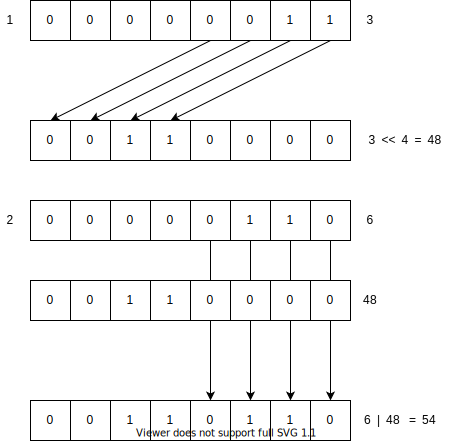
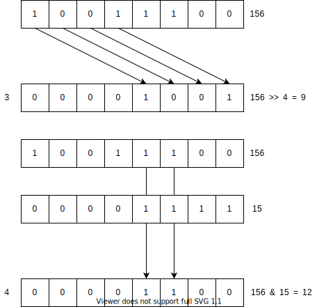

# Salt Go

The SWAN SID Salt implementation in go.

## Introduction

In SWAN, the Salt field is appended as additional data when hashing the email 
address to produce the Signed-in Identifier (SID). 

The salt is made up of four 4 bit numbers (0-15).

It is represented as 2 bytes or a byte array with a length of two, this allows 
for 65535 unique combinations.

The visual representation of the salt is a 4x4 grid:


It contains the following visual items in order, going from left-to-right and 
top-to-bottom:

1. Bear
2. Bicycle
3. Cat
4. Rain Cloud
5. Dog
6. Elephant
7. Crescent Moon
8. House
9. Mountain
10. Airplane 
11. Hare
12. Sheep
13. Swan
14. Train
15. Tree
16. Tulip

A total of four selections must be made, one item may be selected multiple times
but the order is preserved.

The value produced by the salt grid selection is a `Unit4` array AKA an array of
'Nibbles'

For the purposes of salting, the 4 nibbles are converted into a 2 bytes to form 
a byte array. 

The conversion is performed using bit shifting to pack two nibbles into one byte.

|byte|nibble|
|-|-|
|0|0 & 1|
|1|2 & 3|

Nibble 1 & 3 form the first 4 bits of their respective byte and 0 & 2 are bit 
shifted to the left by 4 places to make up the remaining part of their respective 
bytes.

The reverse is done to turn the 2 bytes back in the the original 4 numbers that 
represent the selection.

This allows the value to appended to the byte representation of the email and 
also means the value can be converted to base 64 for transmission. 

### Example
An example for the following selected items:


1. Rain Cloud (4)
2. Crescent Moon (7)
3. Airplane (10)
4. Swan (13)

This gives the list of numbers: `4 - 7 - 10 - 13`
The selection as byte values is: `[3, 6, 9, 12,]`

|Index|1|2|3|4|
|-|-|-|-|-|
|Decimal|3|6|9|12|
|Nibble|0011|0110|1001|1100|
|Binary|00000011|00000110|00001001|00001100|

For the first byte, shift the first nibble to the left 4 places and OR the the 
second nibble:



The value for the first byte is 54.

For the second byte, shift the third nibble over to the left 4 places and OR the 
result and the fourth nibble:


The value for the second byte is 156.

The final byte array is: `[54, 156]`

The byte array is then converted into a base 64 string. For the byte 
array above, this is `Npw=` but the padding is dropped to make it safe to send 
over HTTP so the transmissible value is: `Npw`

### Example - Reversed

To get the selected values for display, the process is reversed.

Take the byte array from before: `[54, 156]`.

To get the first nibble, the first byte is bit shifted to the right by 4. To get 
the second nibble, the bitwise AND operator is applied to the first byte and a 
value of 15, Hex: `0xf` or Bin: `00001111`


The same again for the third and fourth nibbles from the second byte:



The result is the list of values: `[3, 6, 9, 12]`


## Operations

Salt is represented by the type `Salt`. It contains a Data object which is the 
underlying byte array.

```go
type Salt struct {
	Data []byte 
}
```

The following examples assume a selection of `4 - 7 - 10 - 13`

* The resulting array of nibbles is `[3, 6, 9, 12]`
* The resulting byte array is `[54, 156]`
* The resulting Base 64 encoded value is `Npw`

### NewSalt

Creates a new instance of `Salt` from a Base64 encoded byte array. The encoded 
byte array must have a length of 2.

```go
s, err := salt.NewSalt("Npw") // make a new salt with selection: 4 - 7 - 10 - 13
```

### Show

For a given item (1-16), has this item been selected? 1 is subtracted from the
number to get the index. The method will return true if the value minus 1 
appears in the `Salt.Data` byte array.


```go
s, err := salt.NewSalt("Npw") // Selection: 4 - 7 - 10 - 13

s.Show(1) // returns false

s.Show(4) // returns true
```

### Number

For a given item (1-16), what is the order of selection. 1 is subtracted from
number to get the index. The value returned is a number or a list of numbers as
a string which indicate what the order of the selection is.

```go
s, err := salt.NewSalt("Npw") // Selection: 4 - 7 - 10 - 13

s.Number(4) // returns "1"

s.Number(7) // returns "2"

s.Number(1) // returns ""
```

### ToBase64String

Gets the `Salt.Data` byte array as a Base 64 string. The data is first converted 
from the four nibbles into two bytes.

```go
s.ToBase64String() // returns "Npw"
```